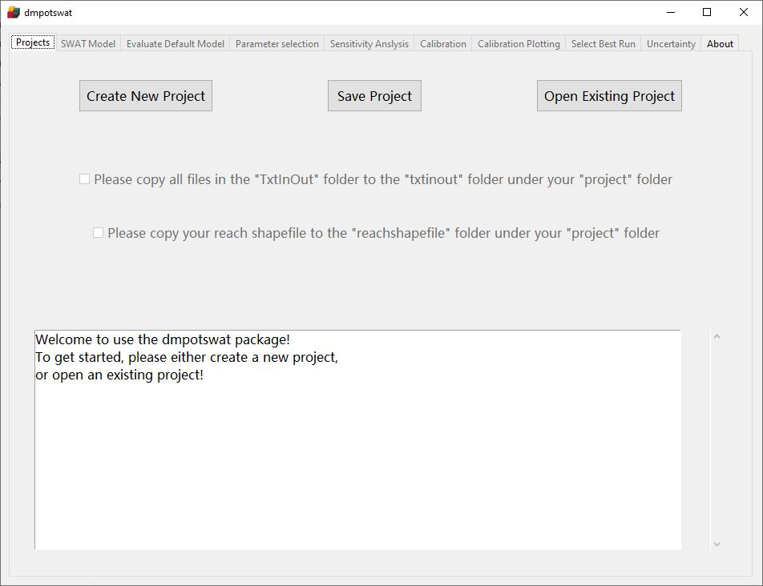

# DMPOTSWAT User Manual

Distributed Model Parameter Optimization Tool for the SWAT model, dmpotswat, is a tool for conducting multivariable and multisite calibration of the SWAT model with the distributed optimization procedure.

## What is distributed model parameter optimization?

Distributed model parameter optimization conducts parameter optimization in a distributed way. There are generally two schemes for multisite calibration. One is simultaneous scheme which determines one optimal solution of parameter sets producing satisfactory calibration results for the whole
watershed. The other scheme is sequential scheme which optimizes objective functions in a cascading way. The determined optimal solution by the simultaneous scheme assumes that the selected optimal set of parameter values fits the whole watersheds. By assuming only one optimal parameter sets, spatial variation of hydrologic responses to geographical conditions in the calibration procedure is not fully captured. Thus, the simultaneous scheme might be suitable for calibrating models of watersheds with less geographic heterogeneity. For watersheds with large area or higher geographical heterogeneity, the optimal solution for the whole watershed cannot fit all areas. The solution is only "partially optimal" for
parts of the watershed instead of "global optimal" for the whole watershed. The scheme generating only one optimal solution for the whole watershed can be considered as "lumped optimization", even though the parameter values are setup in a distributed way. In order to fully capture the spatial variations of hydrologic processes, the modification of parameter values for multiple gauging stations need not to be identical but should be based on conditions of sub-watersheds as in the sequential scheme. The distributed model parameter optimization mode initialize parameters for each subarea group defined by users, and optimize them individually.

## Get started

This program is compiled into one executable file, and can be started by double click it. No installation is needed.

After started, the interface looks like this:

The interface contains 10 labels:

* Projects: Under this lable, users can create, save, or load existing projects.
* SWAT Model：Under this label, details for the SWAT model simulation can be specified. These details includes start and ending dates, warm up period, outlet to be calibrated, variables at each outlet to be calibrated, objective functions used for each target, and their weights if multiple variable and outlet are to be included in one calibration.
* Evaluate Default Model: Under this label, users can calculate values of objective functions and evaluate the model with default parameter values.
* Parameter Selection: Under this label, users can determine target parameters to be included in the calibration process.
* Sensitivity analysis：Under this label, users can conduct sensitivity analysis.
* Calibration: Under this label, users can specify details and conduct calibration.
* Calibration Plotting: Under this label, users can plot the time series plot and flow duration curve plots for any specified run no during the calibration. This label is designed to facilitate the selection of best run no.
* Select Best Run: Under this label, users can select the best run no, and apply the parameters of this run to the txtinout and get calibrated model. Users can also get validated model by setting up the validation period under the SWAT model label.
* Uncertainty: Under this label, users can generate uncertainty maps.
* About: Description of the software.
